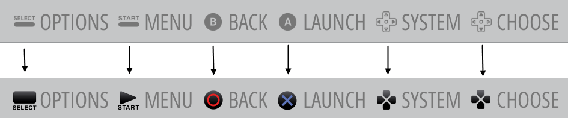
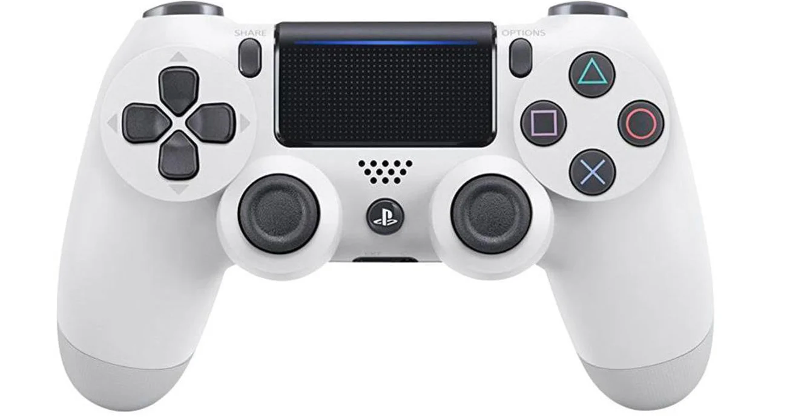

# RetroPie Button Icon Customization

Customize the navigation menu button icons in RetroPie to match your preferred layout.

*some icons are different, the purpose of this image just to give you the idea. (feel free to check what icons included in this repo)
## Why Customize?

If you want your RetroPie gaming experience to match your PS controller, it's time to change the button icons. 
Customizing your icons will help you get the most out of your gaming setup.

## Getting Started

Here's a step-by-step guide to help you get started with this customization:

## Prerequisites
SSH access to your RetroPie system.

## Installation
1. Clone this Git repository to your RetroPie system:

`git clone https://github.com/milinsoft/retropie_update_icons_to_ps.git`

2. Run the script:
`cd retropie_update_icons_to_ps && sudo update_icons.sh`
